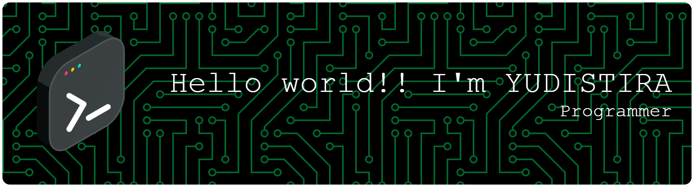

## 💫 About Me:
Programmer dengan ketertarikan besar dalam pengembangan perangkat lunak. Berfokus pada membangun sistem yang fungsional, efisien, dan memberikan solusi terbaik untuk setiap kebutuhan proyek.

## 🌐 Socials:
  

# 💻 Tech Stack:
            
# 📊 GitHub Stats:
 
 

## 🏆 GitHub Trophies

### 🔝 Top Contributed Repo

---

<picture>
  <source media="(prefers-color-scheme: dark)" srcset="https://raw.githubusercontent.com/yuds-del/yuds-del/output/pacman-contribution-graph-dark.svg">
  <source media="(prefers-color-scheme: light)" srcset="https://raw.githubusercontent.com/yuds-del/yuds-del/output/pacman-contribution-graph.svg">
  
</picture>

###

###

  

###